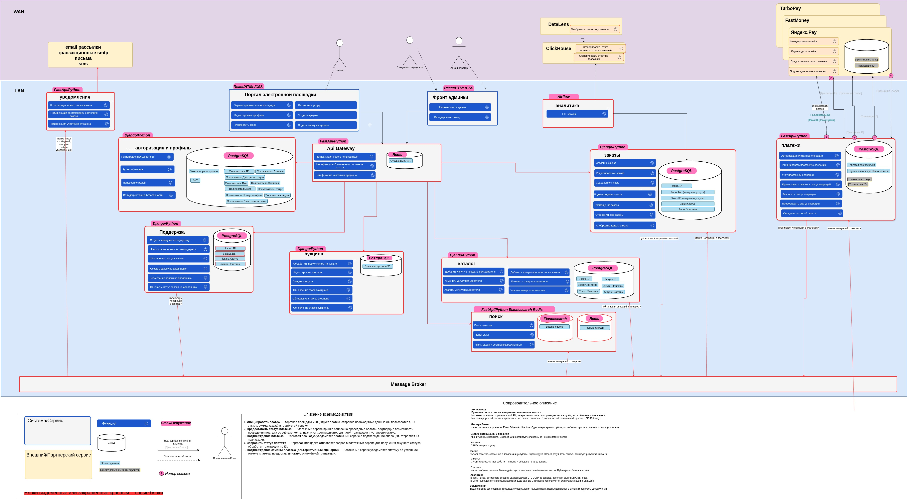

# Задание 1

## Уровень 1. Проектирование
Для разделения монолитной системы выберем Webpack Module Federation по следующим причинам:

Webpack Module Federation работает заточен на работу в рамках одного фреймворка. Он позволит минимизировать переписывание кода и снизить технический долг, т.к.

1. Изначальное приложение было целиком написано на одном фреймворке - на React'е. Мы планируем остаться в рамках этого фреймворка.
2. Наша команда уже знает React. А учитывая, что React - самый популярный фронтенд-фреймворк, мы сможем легко добавить новых разработчиков в случае необходимости.

Также выбор Webpack Module Federation положительно повлияет на производительность. Между нашими микрофронтендами будет шаринг зависимостей. Вместо того, чтобы изолировать повторяющиеся зависимости в рамках каждого микрофронтенда, увеличивая бандл, как это было бы в случае, если бы мы выбрали single SPA.

## Уровень 2. Планирование изменений
Почти нет состояний, которые нужно отобображать в нескольких местах. Поэтому можно инкапсулировать логику в микрофронтендах по доменным областям:
- auth (регистрация, вход, выход)
- profile (получение, редактирование профиля)
- places (работа с карточками мест)

С заделом на будущее мы можно вынести небольшие ui-компоненты вроде кнопок, тултипов, модалок в отдельный модуль. Это позволит сохранять последовательный пользовательский опыт.
- ui

Также с заделом на будущее можно вынести в отдельный модуль работу с состоянием. Так можно иметь глобальное хранилище состояния, используя библиотеки вроде redux или zustand. Или простые самописные реализации pub/sub или event-bus.
- store

Но в нашем случае это будет излишним. Можно положить общие ui-компоненты в host, а состоянием обмениваться через кастомные js event'ы. Точкой входа, сборщиком всех остальных микрофронтендов будет:
- host

В host есть context для передачи информации о пользователе. Мы оставим его на этом уровне. Однако, чтобы пользоваться им в наших микрофронтендах, нам нужно будет добавить CurrentUserContext в exposes.

В папке utils содержатся запросы к api. Файл api.js содержит запросы для работы с разными сущнастями, в рамках каждого микрофронтенда мы оставим только нужные. <br>
- В микрофронтенде profile останутся: getCardList, addCard, removeCard, changeLikeCardStatus.
- В places останутся: getUserInfo, setUserInfo, setUserAvatar.
- В host останется getAppInfo. Но запросы теперь будут браться из других микрофронтендов.

Распределение остального функционала продемонстрировано в tree ниже:

```
├── auth
│   ├── Dockerfile
│   ├── package.json
│   ├── src
│   │   ├── App.jsx
│   │   ├── components
│   │   │   ├── Login.js
│   │   │   ├── ProtectedRoute.js
│   │   │   └── Register.js
│   │   ├── index.css
│   │   ├── index.html
│   │   ├── index.js
│   │   ├── styles
│   │   │   ├── auth-form
│   │   │   │   ├── auth-form.css
│   │   │   │   ├── __button
│   │   │   │   │   └── auth-form__button.css
│   │   │   │   ├── __form
│   │   │   │   │   └── auth-form__form.css
│   │   │   │   ├── __input
│   │   │   │   │   └── auth-form__input.css
│   │   │   │   ├── __link
│   │   │   │   │   └── auth-form__link.css
│   │   │   │   ├── __text
│   │   │   │   │   └── auth-form__text.css
│   │   │   │   ├── __textfield
│   │   │   │   │   └── auth-form__textfield.css
│   │   │   │   └── __title
│   │   │   │       └── auth-form__title.css
│   │   │   └── login
│   │   │       └── login.css
│   │   └── utils
│   │       └── auth.js
│   └── webpack.config.js
├── docker-compose.yml
├── host
│   ├── Dockerfile
│   ├── package.json
│   ├── src
│   │   ├── App.jsx
│   │   ├── components
│   │   │   ├── App.js
│   │   │   ├── Footer.js
│   │   │   ├── Header.js
│   │   │   ├── ImagePopup.js
│   │   │   ├── InfoTooltip.js
│   │   │   ├── Main.js
│   │   │   └── PopupWithForm.js
│   │   ├── contexts
│   │   │   └── CurrentUserContext.js
│   │   ├── images
│   │   │   ├── add-icon.svg
│   │   │   ├── avatar.jpg
│   │   │   ├── card_1.jpg
│   │   │   ├── card_2.jpg
│   │   │   ├── card_3.jpg
│   │   │   ├── close.svg
│   │   │   ├── delete-icon.svg
│   │   │   ├── edit-icon.svg
│   │   │   ├── error-icon.svg
│   │   │   ├── like-active.svg
│   │   │   ├── like-inactive.svg
│   │   │   ├── logo.svg
│   │   │   └── success-icon.svg
│   │   ├── index.css
│   │   ├── index.html
│   │   ├── index.js
│   │   ├── logo.svg
│   │   ├── styles
│   │   │   ├── content
│   │   │   │   └── content.css
│   │   │   ├── footer
│   │   │   │   ├── __copyright
│   │   │   │   │   └── footer__copyright.css
│   │   │   │   └── footer.css
│   │   │   ├── header
│   │   │   │   ├── __auth-link
│   │   │   │   │   └── header__auth-link.css
│   │   │   │   ├── header.css
│   │   │   │   ├── __logo
│   │   │   │   │   └── header__logo.css
│   │   │   │   ├── __logout
│   │   │   │   │   └── header__logout.css
│   │   │   │   ├── __user
│   │   │   │   │   └── header__user.css
│   │   │   │   └── __wrapper
│   │   │   │       └── header__wrapper.css
│   │   │   ├── page
│   │   │   │   ├── __content
│   │   │   │   │   └── page__content.css
│   │   │   │   ├── page.css
│   │   │   │   └── __section
│   │   │   │       └── page__section.css
│   │   │   └── popup
│   │   │       ├── __button
│   │   │       │   ├── _disabled
│   │   │       │   │   └── popup__button_disabled.css
│   │   │       │   └── popup__button.css
│   │   │       ├── __caption
│   │   │       │   └── popup__caption.css
│   │   │       ├── __close
│   │   │       │   └── popup__close.css
│   │   │       ├── __content
│   │   │       │   ├── _content
│   │   │       │   │   └── popup__content_content_image.css
│   │   │       │   └── popup__content.css
│   │   │       ├── __error
│   │   │       │   ├── popup__error.css
│   │   │       │   └── _visible
│   │   │       │       └── popup__error_visible.css
│   │   │       ├── __form
│   │   │       │   └── popup__form.css
│   │   │       ├── __icon
│   │   │       │   └── popup__icon.css
│   │   │       ├── __image
│   │   │       │   └── popup__image.css
│   │   │       ├── __input
│   │   │       │   ├── popup__input.css
│   │   │       │   └── _type
│   │   │       │       └── popup__input_type_error.css
│   │   │       ├── _is-opened
│   │   │       │   └── popup_is-opened.css
│   │   │       ├── __label
│   │   │       │   └── popup__label.css
│   │   │       ├── popup.css
│   │   │       ├── __status-message
│   │   │       │   └── popup__status-message.css
│   │   │       ├── __title
│   │   │       │   └── popup__title.css
│   │   │       └── _type
│   │   │           ├── popup_type_edit-avatar.css
│   │   │           └── popup_type_remove-card.css
│   │   └── vendor
│   │       ├── fonts
│   │       │   ├── Inter-Black.woff2
│   │       │   └── Inter-Regular.woff2
│   │       ├── fonts.css
│   │       └── normalize.css
│   └── webpack.config.js
├── places
│   ├── Dockerfile
│   ├── package.json
│   ├── src
│   │   ├── App.jsx
│   │   ├── components
│   │   │   ├── AddPlacePopup.js
│   │   │   └── Card.js
│   │   ├── index.css
│   │   ├── index.html
│   │   ├── index.js
│   │   ├── styles
│   │   │   ├── card
│   │   │   │   ├── card.css
│   │   │   │   ├── __delete-button
│   │   │   │   │   ├── card__delete-button.css
│   │   │   │   │   ├── _hidden
│   │   │   │   │   │   └── card__delete-button_hidden.css
│   │   │   │   │   └── _visible
│   │   │   │   │       └── card__delete-button_visible.css
│   │   │   │   ├── __description
│   │   │   │   │   └── card__description.css
│   │   │   │   ├── __image
│   │   │   │   │   └── card__image.css
│   │   │   │   ├── __like-button
│   │   │   │   │   ├── card__like-button.css
│   │   │   │   │   └── _is-active
│   │   │   │   │       └── card__like-button_is-active.css
│   │   │   │   ├── __like-count
│   │   │   │   │   └── card__like-count.css
│   │   │   │   └── __title
│   │   │   │       └── card__title.css
│   │   │   └── places
│   │   │       ├── __item
│   │   │       │   └── places__item.css
│   │   │       ├── __list
│   │   │       │   └── places__list.css
│   │   │       └── places.css
│   │   └── utils
│   │       └── api.js
│   └── webpack.config.js
└── profile
    ├── Dockerfile
    ├── package.json
    ├── src
    │   ├── App.jsx
    │   ├── components
    │   │   ├── EditAvatarPopup.js
    │   │   └── EditProfilePopup.js
    │   ├── index.css
    │   ├── index.html
    │   ├── index.js
    │   ├── styles
    │   │   └── profile
    │   │       ├── __add-button
    │   │       │   └── profile__add-button.css
    │   │       ├── __description
    │   │       │   └── profile__description.css
    │   │       ├── __edit-button
    │   │       │   └── profile__edit-button.css
    │   │       ├── __image
    │   │       │   └── profile__image.css
    │   │       ├── __info
    │   │       │   └── profile__info.css
    │   │       ├── profile.css
    │   │       └── __title
    │   │           └── profile__title.css
    │   └── utils
    │       └── api.js
    └── webpack.config.js
```
## Уровень 3. Запуск готового кода
Не реализован.

# Задание 2
Ссылка на draw.io: <br>
https://drive.google.com/file/d/1GLP12iT5S1oOn1o2nPow9K5WAwXHsE0R/view?usp=sharing

Та же схема в виде картинки:

